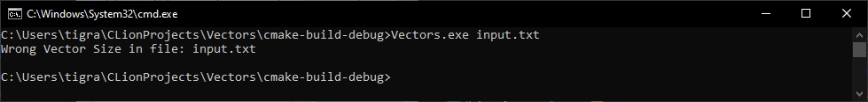
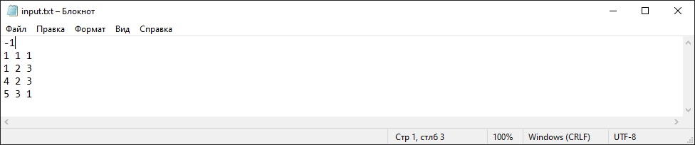
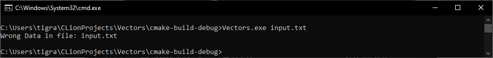
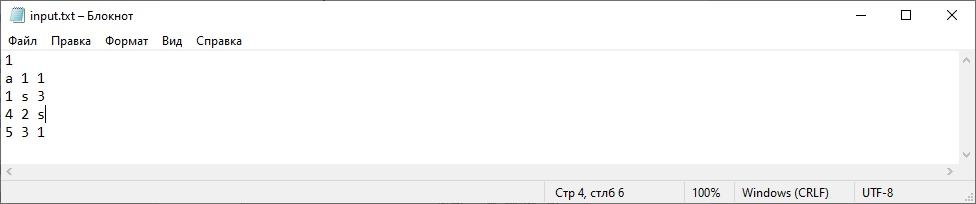
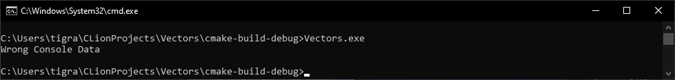
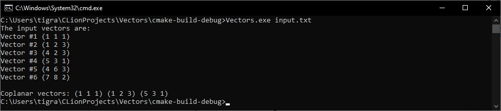
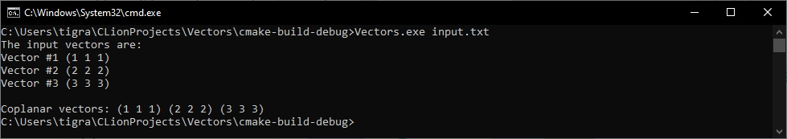
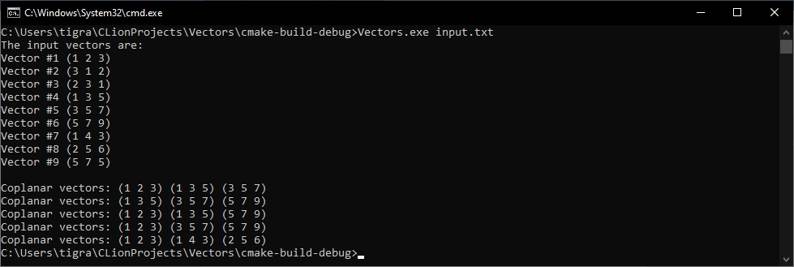

# Программа для нахождения всех возможных троек компланарных векторов из множества не равных между собой векторов (x, y, z).
## Выполнил студент БПИ199 Кочарян Тигран Самвелович <tskocharyan@edu.hse.ru>.
---

## Описание работы программы:

#### Программа через консоль принимает на вход строку, которая является названием файла, который находится в одной директорией с исполняемым файлом или абсолютным путем к этому файлу. 

* Считывание данных из файла обосновано тем, что таким образом достаточно удобно структурировать и считать количество векторов и сами вектора. В файле сначала должно находиться целочисленное значение общего количества векторов. Затем для каждого вектора будет по очереди введены целые числа - значения координат x, y, z. 

#### При считывании данных из файла происходят следующие проверки на валидность данных:

* Если в консоль было передано неверное количество аргументов, то будет выведено соответствующее сообщение об ошибке и программа завершит свою работу.
* Если при попытке потока ввода данных открыть файл произошла ошибка, то будет выведено соответствующее сообщение об ошибке и программа завершит свою работу. Проверка осуществляется с помощью флага good()
* Если в самом файле вместо целочисленного значения будет храниться некорректный вид данных (например, вместо числа будет храниться строка, которая не может быть переведена в число), то будет выведено соответствующее сообщение об ошибке и программа завершит свою работу. Проверка осуществляется с помощью флага fail()

#### Файл должен иметь вид:

* На первой строке записано количество векторов <N>. (N > 0)
* Затем идут N строк по 3 числа. Каждое число целое и обозначает соответствующую координату вектора <x y z>
* Если все проверки были пройдены успешно, то по мере считывания векторов и их координат, программа заполняет одномерный массив проиндексированных элементов. Затем программа пронумеровано выводит в консоль все считанные вектора.

#### Для решения задачи фундаментальными являются два метода:

* Метод проверки на компланарность isCoplanar принимает на вход 3 параметра - вектора a,b,c и по формуле смешанного произведения проверяет, равен ли результат смешанного произведения 0. Если да, то тройка компланарна, в случае нет - некомпланарна.
* Метод threadFunction принимает на вход текущую позицию вектора i и проходясь от i+1 и i+2 до общего количества векторов, проверяет, компланарны ли векторы i, i+1, i+2. Если да, то в консоль выводится сообщение с информацией о компланарных векторах.

#### Для ускоренной проверки на компланарность трех векторов программа использует разделение работы на потоки. 

* В данной задаче было принято решение использовать итеративный параллелизм и воспользоваться командами OpenMP, так как процессы выполняют циклические вычисления, решая одну поставленную задачу. 
* OpenMP обрабатывает цикл и запускает оптимальное решение потоков.

#### В конце работы всех потоков программа завершает свое выполнение.
---

## Примеры работы кода (более конкретные примеры с потоками OpenMP указаны в ПЗ):

#### Скриншот 1. Некорректное значение количества векторов в файле. Вывод в консоль сообщения об ошибке и завершение работы.

#### Скриншот 2. Отсутствие файла, указанного в параметрах командной строки. Вывод сообщения о соответствующей ошибке в консоль и завершение работы приложения..

#### Скриншот 3. Некорректный тип данных количества векторов или координат вектора (например, строка или символ). Вывод сообщения о соответствующей ошибке в консоль и завершение работы приложения.

#### Скриншот 4. Некорректные введенные параметры в консоль при запуске. Вывод сообщения о соответствующей ошибке в консоль и завершение работы приложения.

#### Скриншот 5. Файл с входными данными содержит корректные данные о 6 векторах. Вывод каждым потоком отдельно всех найденных им компланарных векторов и завершение работы.

#### Скриншот 6. Файл с входными данными содержит корректные данные о 3 векторах. Вывод каждым потоком отдельно всех найденных им компланарных векторов и завершение работы.

#### Скриншот 7. Файл с входными данными содержит корректные данные о 9 векторах. Вывод каждым потоком отдельно всех найденных им компланарных векторов и завершение работы.

---

## [Контакты.](https://vk.com/k_tigran)
